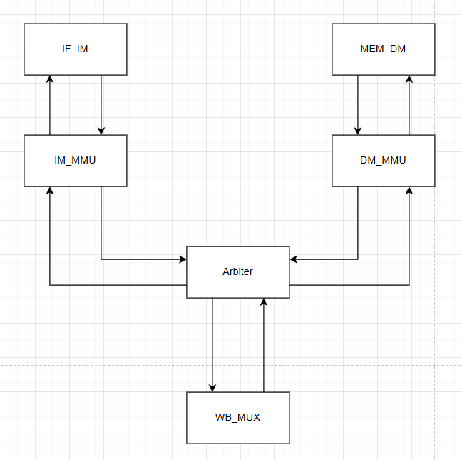
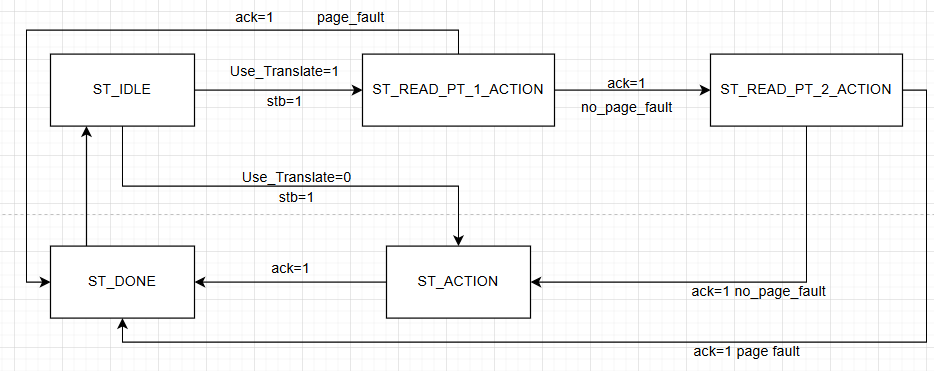
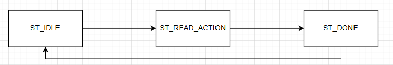
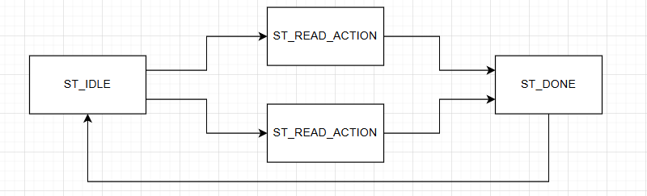

# 监控程序V3.5

## 新总线结构

## IM_MMU

### 输入输出

输入：

来自IF_IM的一系列信号、来自EXPT_PROC的satp、当前机器态

输出：

给arbiter的一系列信号

### 状态机

1. ST_IDLE：等待stb，收到stb后检查satp mode和当前机器态，设置reply_ack=0
   1. 若页表生效
      1. 用vpn查询TLB，得到hit（组合逻辑）
      2. hit=0，从satp取出基地址、和vpn1计算得到访存地址，进入ST_READ_PT_1_ACTION
      3. hit=1，复制来自IF_IM的请求，拿PA，直接进入ST_ACTION
   2. 否则，复制来自IF_IM的请求，直接进入ST_ACTION
2. ST_READ_PT_1_ACTION：等待ack，等到后取出pte
   1. 检查pte的各个标志位是否符合要求
      1. 检查v、r、w，判断pte是否有效，无效则触发异常，进入ST_DONE，设置reply_ack=1，reply_err=1
      2. 有效，则pte和vpn0计算得到下一个访存地址，进入ST_READ_PT_2_ACTION
3. ST_READ_PT_2_ACTION：等待ack，等到后取出pte
   1. 检查pte的各个标志位是否符合要求
      1. 检查v、r、w，判断pte是否有效，无效则触发异常，进入ST_DONE，设置reply_ack=1，reply_err=1
      2. 检查x、u，判断这个内存访问是否允许，不被允许则触发异常 ，进入ST_DONE，设置reply_ack=1，reply_err=1
      3. 有效，pte和vpo计算得到最终访存地址，复制部分来自im的请求，进入ST_ACTION
         1. 同时给信号写TLB
4. ST_ACTION：接收到ack才设置reply_ack=1，进入ST_DONE
5. ST_DONE：回到ST_IDLE，设置reply_ack=0

## DM_MMU

### 输入输出

输入：

来自MEM_DM的一系列信号、来自EXPT_PROC的satp、当前机器态

输出：

给arbiter的一系列信号

### 状态机

1. ST_IDLE：等待stb，收到stb后检查satp mode和当前机器态，设置reply_ack=0
   1. 若页表生效
      1. 用vpn查询TLB，得到hit（组合逻辑）
      2. hit=0，从satp取出基地址、和vpn1计算得到访存地址，进入ST_READ_PT_1_ACTION
      3. hit=1，复制来自MEM_DM的请求，拿PA，直接进入ST_ACTION
   2. 否则，复制来自MEM_DM的请求，直接进入ST_ACTION
2. ST_READ_PT_1_ACTION：等待ack，等到后取出pte
   1. 检查pte的各个标志位是否符合要求
      1. 检查v、r、w，判断pte是否有效，无效则触发异常，进入ST_DONE，设置reply_ack=1，reply_err=1
      2. 有效，则pte和vpn0计算得到下一个访存地址，进入ST_READ_PT_2_ACTION
3. ST_READ_PT_2_ACTION：等待ack，等到后取出pte
   1. 检查pte的各个标志位是否符合要求
      1. 检查v、r、w，判断pte是否有效，无效则触发异常，进入ST_DONE，设置reply_ack=1，reply_err=1
      2. 根据访存是读/写，检查r、w、u，判断这个内存访问是否允许，不被允许则触发异常，进入ST_DONE，设置reply_ack=1，reply_err=1
      3. 有效，pte和vpo计算得到最终访存地址，复制部分来自dm的请求，进入ST_ACTION
         1. 同时给信号写TLB
4. ST_ACTION：接收到ack才设置reply_ack=1，进入ST_DONE
5. ST_DONE：回到ST_IDLE，设置reply_ack=0

## IF_IM修改

### 输入输出

增加给流水线下一段的mepc、mcause、mtval、excp

### 状态机

1. ST_IDLE：
   1. 新增加判断条件page_fault_flag，详见“关于新的冲突/Page Fault之后部分”
2. ST_READ_ACTION：
   1. 若收到ack==1&&err==1：设置query_ack=1，excp=1，报告mepc、mcause、mtval，进入ST_DONE
   2. 否则收到ack==1：设置query_ack=1，excp=0，进入ST_DONE
3. ST_DONE：和之前相同

## MEM_DM修改

### 输入输出

增加给EXPT_PROC的信号excp、mepc、mcause、mtval

### 状态机

1. ST_IDLE：和之前相同
2. ST_READ_ACTION / ST_WRITE_ACTION：
   1. 若收到ack==1&&err==1：设置query_ack=1，excp=1，报告mepc、mcause、mtval，进入ST_DONE
   2. 否则收到ack==1：设置query_ack=1，excp=0，进入ST_DONE
3. ST_DONE：和之前相同

## 关于新的冲突

### CSR写

- 对于DM_MMU，因为CSR写和DM访存都在MEM段，不会同时出现，故不会产生冲突
- 对于IM_MMU，检查页表时需用到satp，这时ID/EXE/MEM段可能会写csr，需要考虑数据前传？
  - 检测ID/EXE/MEM段的指令是否为CSRRX，是的话是否目的csr寄存器为satp，如果是，需要额外计算
  - 优先级ID>EXE>MEM，但由于有置位指令（用到上一步csr），需要从后向前算

### ID段跳转

- 对于DM_MMU，在ST_READ_PT_1_ACTION、ST_READ_PT_2_ACTION期间reply_ack=0 -> query_ack=0这样自然会阻拦潜在的ID段跳转
- 对于IM_MMU，ID段跳转指令本来就在取值指令之前，不应阻拦其跳转

### Page fault之后

- 发生Page Fault之后就不应该执行后续指令，需要对IF_IM这种会连续取指的做出特殊调整
  - 如果有一条指令的Page Fault流到了MEM，使得特权态变化，则IF_IM坚持取指则不会让MMU翻译，产生意料之外的后果
- 因此，IF_IM添加一个额外标记page_fault_flag，如果当前指令发生了page_fault则不再对新的pc取指，直到page fault被处理完（从EXCP_PROC获取信号）

## TLB

### TLB设计

- 分为I-ILB和D-TLB，分别与IM_MMU和DM_MMU相连
- 只做1条，全相联
- 实现为单独的TLB模块
  - 读部分
    - 组合逻辑
    - 输入VPN
    - 输出PPN和hit
  - 写部分
    - 一个周期写
    - 若失配，则在MMU的ST_READ_PT_2_ACTION收到ppn时写

### SFENCE.VMA

ID阶段decode完直接连信号给两个TLB清空

## 文档中的问题

1. 监控程序使用的是动态页表映射还是静态的？

静态

2. 监控程序本身使用的地址是虚拟地址吗？

不是

3. G 指令指定的用户程序地址应为虚拟地址还是物理地址？A 指令呢？

虚拟地址、物理地址（因为还在M态）

4. （非必须）缺页异常处理程序应该如何获得发生缺页的虚拟地址？

## 全部修改

- 修改IF_IM、MEM_DM，来处理page fault
- 新增IM_MMU、DM_MMU
- 修改MEM_EXCEPTION_PROCESSOR来维护satp
- 修改thinpad_top中连线
- ID_DECODER中新增sfence.vma为nop

## 测试

- 正常情况测试

写UTEST_PUTC，A 80100000，再G 0，期待正常运行

- 异常情况测试

G 00300000，期待给出page fault

tb.sv中添加了这两种情况，逐byte从串口发

- 测试cryptonight

其中有用到dm mmu

约17s

## V3.5新修改

- 增加TLB
- 添加MMU中查tlb逻辑
- 实现SFENCE.VMA
